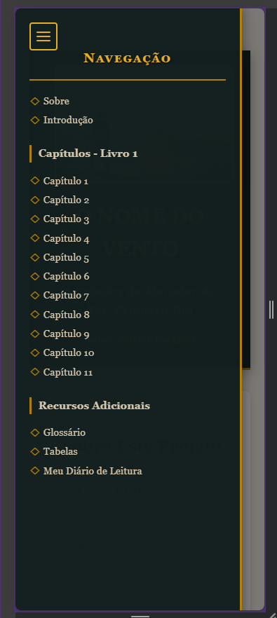
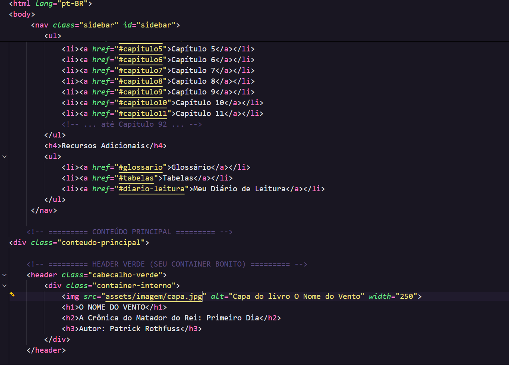
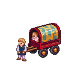

# 📚 O Nome do Vento - Experiência Literária Digital

<div align="center">

[](https://developer.mozilla.org/en-US/docs/Web/HTML)
[](https://developer.mozilla.org/en-US/docs/Web/CSS)
[](https://developer.mozilla.org/en-US/docs/Web/JavaScript)
[](https://git-scm.com/)

*Uma jornada imersiva através da obra de Patrick Rothfuss - Desenvolvido com paixão e código*

</div>

## ⚠️ AVISO LEGAL IMPORTANTE

<div align="center" style="background-color: #7e3a1bc2; border: 2px solid #ddab16e7; border-radius: 10px; padding: 20px; margin: 20px 0;">

### 📖 PROJETO EDUCACIONAL - SEM FINS COMERCIAIS

**Este é um projeto PESSOAL para fins EDUCACIONAIS** de desenvolvimento front-end.

🚫 **NÃO contém capítulos completos** do livro  
🚫 **NÃO possui fins comerciais**  
🚫 **NÃO afeta os direitos autorais** do autor

**🔸 Apoie o autor original:**  
Se interessou pela história? **COMPRE O LIVRO!**  
**"O Nome do Vento"** está disponível no Brasil pela **Editora Arqueiro**  
Todos os direitos reservados a **Patrick Rothfuss**

</div>

## 📖 Sobre a Obra

**"O Nome do Vento"** é o primeiro livro da trilogia **As Crônicas do Matador do Rei**, escrita por Patrick Rothfuss. A história segue **Kvothe**, um homem extraordinário envolto em lendas, que agora vive anonimamente como um simples estalajadeiro. Através de sua narrativa, descobrimos sua jornada desde criança prodígio em uma trupe de artistas itinerantes até se tornar um lendário arcanista, músico e... matador de reis.

> *"Temos tempo. Temos o tempo todo."* - Kvothe

## 🎯 Sobre Este Projeto

Este projeto representa minha **jornada de aprendizado em desenvolvimento front-end**, unindo minha paixão por tecnologia e literatura. Desenvolvido como uma fan page educacional e imersiva, serve como campo de prática para tecnologias modernas com foco no mercado brasileiro.

**Status:** 🚧 Desenvolvimento Ativo  
**Stack Principal:** HTML5, CSS3, JavaScript Vanilla  
**Próxima Fase:** React.js

---

## ✨ Demonstração Visual

<div align="center">

### 🖥️ Layout Desktop


### 📱 Layout Mobile Responsivo



### 💻 Estrutura de Código Organizada


### 🎮 Pixel Arts Exclusivas
<div style="display: flex; justify-content: center; gap: 15px; margin: 20px 0;">
  
  
  
</div>

</div>

---

## 🛠️ Tecnologias e Funcionalidades

### ✅ **IMPLEMENTADO E FUNCIONANDO**

#### **Frontend Sólido**
- **HTML5 Semântico** - Estrutura acessível e SEO-friendly
- **CSS3 Avançado** - Grid, Flexbox, Variáveis CSS, Animations
- **JavaScript Vanilla** - Interatividade sem dependências
- **Design System** - Cores temáticas baseadas na obra

#### **Experiência do Usuário**
- **Navegação Suave** - Scroll entre seções
- **Menu Responsivo** - Hambúrguer para mobile
- **Scrollbar Customizada** - Tema dourado exclusivo
- **Layout Adaptativo** - Funciona em todos os dispositivos

#### **Conteúdo Organizado**
- **Capítulos Estruturados** - Com avisos de direitos autorais
- **Glossário Interativo** - Termos da obra organizados
- **Seção de Dados** - Personagens e timeline da história
- **Pixel Arts Exclusivas** - Arte digital personalizada

### 🚧 **EM DESENVOLVIMENTO**

#### **Fase 2 - React & Features Avançadas**
- [ ] **Migração para React** com Hooks e Context API
- [ ] **Sistema de Comentários** em tempo real
- [ ] **Diário de Leitura** persistente
- [ ] **Busca no Glossário** 
- [ ] **Modo Noturno/Dia**
- [ ] **Progresso de Leitura** salvo automaticamente

#### **Fase 3 - Backend & Segurança**
- [ ] **Autenticação de Usuários** 
- [ ] **Banco de Dados** (MongoDB/Firebase)
- [ ] **API RESTful** para dados dinâmicos
- [ ] **Criptografia** de dados sensíveis
- [ ] **Features Educativas** de cybersecurity

---

## 🎨 Decisões Técnicas Explicadas

### **🏗️ Por Que Vanilla JS Primeiro?**
```javascript
// Fundamentos sólidos antes de frameworks
document.querySelectorAll('nav a').forEach(link => {
    link.addEventListener('click', smoothScroll);
});
```
**Motivação:** Dominar JavaScript puro garante compreensão profunda dos conceitos e capacidade de resolver problemas complexos sem dependência de bibliotecas.

### **🎨 Arquitetura CSS Escalável**
```css
/* Design System com variáveis CSS */
:root {
    --ouro-principal: #b18005;
    --verde-universidade: #132020;
    --parchment: #f5f1e8;
    --sombra-suave: 0 2px 10px rgba(0, 0, 0, 0.1);
}
```
**Motivação:** Manutenibilidade, consistência visual e preparação para Styled Components no futuro.

### **📱 Mobile-First com Progressive Enhancement**
```css
/* Base mobile primeiro */
.sidebar { display: none; }

/* Desktop enhancements */
@media (min-width: 769px) {
    .sidebar { display: block; }
}
```
**Motivação:** Garantir funcionalidade em todos os dispositivos, melhor performance e SEO.

---

## 📁 Estrutura do Projeto

```
nome-do-vento/
├── 📄 index.html                 # Página principal
├── 🎨 estilo-livro.css           # Estilos principais
├── ⚡ script.js                  # JavaScript completo
├── 📄 README.md                  # Documentação
└── 📁 assets/
    ├── 📁 images/
    │   ├── 🎮 pixel-arts/        # Arte digital exclusiva
    │   └── 📸 screenshots/       # Capturas para documentação
    └── 📁 data/                  # Futuros arquivos de dados
```

---

## 🚀 Como Executar o Projeto

### **Requisitos:**
- Navegador moderno (Chrome, Firefox, Safari, Edge)
- Servidor local (recomendado) ou abrir direto no navegador

### **Passos:**
```bash
# 1. Clone o repositório
git clone https://github.com/seu-usuario/nome-do-vento.git

# 2. Acesse a pasta
cd nome-do-vento

# 3. Abra no navegador
# Opção A: Servidor local (Python)
python -m http.server 8000
# Acesse: http://localhost:8000

# Opção B: Servidor local (Node.js)
npx serve
```

---

## 📈 Roadmap de Desenvolvimento

### **🎯 Curto Prazo (2-3 semanas)**
- [ ] Finalizar conteúdo dos capítulos restantes
- [ ] Implementar sistema de comentários local
- [ ] Criar glossário interativo com busca
- [ ] Adicionar mais pixel arts de personagens

### **🚀 Médio Prazo (1 mês)**
- [ ] Migração para React + Vite
- [ ] Integração com Firebase
- [ ] Sistema de autenticação simples
- [ ] Deploy na Vercel/Netlify

### **💫 Longo Prazo (2-3 meses)**
- [ ] Features educativas de cybersecurity
- [ ] PWA (Progressive Web App)
- [ ] Sistema de usuários completo
- [ ] Animações CSS avançadas

---

## 🤝 Contribuições

Este é um **projeto de estudo pessoal**, mas sugestões são muito bem-vindas!

1. Fork o projeto
2. Crie uma branch: `git checkout -b feature/nova-feature`
3. Commit suas mudanças: `git commit -m 'Adiciona nova feature'`
4. Push para a branch: `git push origin feature/nova-feature`
5. Abra um Pull Request

---

## 📊 Metodologia de Desenvolvimento

### **🌱 Commits Constantes & GitHub "Sempre Verde"**
Adoto a prática de **commits frequentes** para demonstrar:
- Evolução contínua e progresso visível
- Habilidade com controle de versão (Git)
- Capacidade de dividir tarefas complexas em etapas
- Transparência no processo de desenvolvimento

**Para recrutadores:** Cada commit verde representa um problema resolvido, uma feature implementada, um aprendizado consolidado na prática.

---

## 🎓 Aprendizados e Próximos Passos

### **Conceitos Dominados:**
- HTML5 Semântico e Acessibilidade
- CSS3 Moderno (Grid, Flexbox, Variáveis)
- JavaScript ES6+ (DOM Manipulation, Events)
- Responsive Design e Mobile-First
- Git e Controle de Versão
- Design Systems e UI/UX Básico

### **Próximos Aprendizados:**
- React.js e Ecossistema Moderno
- Backend Development (Node.js, APIs)
- Cybersecurity Fundamentals
- Performance Optimization
- Testing (Jest, Cypress)

---

<div align="center">

## 📞 Contato

[](https://www.linkedin.com/in/romaonanda/)
[](https://github.com/NandaRomao)

**"Palavras são luz para a mente e fogo para a alma."** - Artefano

---
*Desenvolvido com 💖 e muito chocolate (pois não gosto de café), assim como o Kvothe precisa para suas simpatias*


▔▔▔▔▔▔▔▔▔▔▔▔▔▔▔▔▔▔▔▔

**🌸 Crafted by Mokshyaa 🌸**

</div>